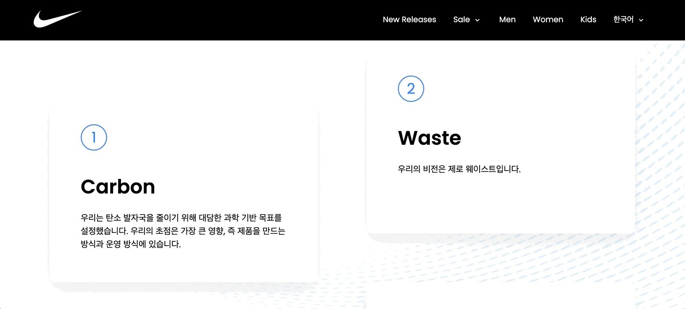

# :pushpin: 나이키

> 나이키 홈페이지를 awwwards 등의 래퍼런스를 참조하여 개인적으로 재구성한 프로젝트입니다.
> 이 프로젝트는 현대적인 웹 디자인과 인터랙티브 요소를 적용하여 사용자 경험을 극대화하는 것에
> 중점을 두었습니다.(개인 프로젝트)
>
> https://jhree333.github.io/nike-portfolio/

</br>

## 1. 제작 기간

- 7일
- 개인 프로젝트

</br>

## 2. 사용 기술

- 프런트엔드: HTML, CSS, SCSS, JavaScript
- 라이브러리 및 프레임워크:, Swiper (슬라이더 구현), GSAP (애니메이션 효과)
- 디자인: 모던하고 직관적인 UI/UX 디자인에 초점

</br>

## 3. 인터렉티브 기능

- 슬라이더와 애니메이션 효과를 통해 사용자의 상호작용을 유도하고,
  보다 생동감 있는 웹사이트 경험을 제공합니다.

<details>
<summary><b>인터렉션 기능 설명 펼치기</b></summary>
<div markdown="1">

### 3.1 홈페이지 자동 스와이프 효과


```js
export default function updateHome() {
  new Swiper(".slide01", {
    effect: "fade",
    autoplay: {
      delay: 2500,
      disableOnInteraction: false,
    },
    speed: 1000,
    loop: true,
  });
}
```

### 3.2. 마우스 스크롤시 고정되는 효과


```js
export default function updatePromise() {
  let motion01 = gsap.timeline({});
  // 초기 위치에서 아래로 5%만큼 이동시킨 후, 최종적으로 위로 70%만큼 이동시키는 효과
  motion01.fromTo(".promise_items", { yPercent: 5 }, { yPercent: -70 });

  ScrollTrigger.create({
    animation: motion01,
    trigger: ".sc_promise",
    start: "top top", // 트리거 요소가 뷰포트의 상단에 닿으면 스크롤 트리거가 시작
    end: "+=250%", // 트리거 요소의 높이를 250%만큼 스크롤한 지점에서 트리거가 비활성화
    // markers: true, // 트리거와 애니메이션의 경계를 시각적으로 확인할 수 있는 마커
    scrub: 1, // 애니메이션을 부드럽게 진행시키는 효과
    pin: true, // 애니메이션이 실행되는 동안 해당 요소를 고정시켜 놓는 효과
  });

  $(".promise_item").each(function (_, item) {
    ScrollTrigger.create({
      trigger: item,
      start: "top 50%", // 뷰포트의 상단에서 아이템의 상단이 50% 정도 위치일 때 트리거가 활성화
      end: "bottom 70%", // 뷰포트의 하단에서 아이템의 하단이 70% 정도 위치일 때 트리거가 비활성화,
      // markers: true,

      onLeave: () => {
        $(this).removeClass("on");
        $(".promise_link_item").removeClass("on");
      },

      onLeaveBack: () => {
        $(this).removeClass("on");
      },

      onEnter: () => {
        $(this).addClass("on");
        // 현재 반복되는 .promise_item 요소의 인덱스를 가져오고,
        // 그 인덱스에 해당하는 .promise_link_item 요소를 선택하여 클래스 'on'을 추가.
        // 이것은 각 .promise_item이 스크롤 영역에 들어올 때
        // 해당하는 링크에 'on' 클래스를 추가하여 특별한 스타일이나 동작을 적용하는 용도로 사용.
        let idx = $(this).index();
        $(".promise_link_item").removeClass("on");
        $(".promise_link_item").eq(idx).addClass("on");
      },

      onEnterBack: () => {
        $(this).addClass("on");
        let idx = $(this).index();
        $(".promise_link_item").removeClass("on");
        $(".promise_link_item").eq(idx).addClass("on");
      },
    });
  });
}
```

### 3.3 요소의 마우스 움직임에 반응하여 동적으로 회전하는 효과



```js
export default function updateApproach() {
  $(".approach_item").mousemove(function (e) {
    let x = e.offsetX;
    let y = e.offsetY;
    const width = $(this).width();
    const height = $(this).height();

    // 마우스 위치에 따라 x, y값을 동적으로 계산
    x = (x / width - 0.5) * 20; // x 값을 -10에서 10 사이로 조정
    y = (y / height - 0.5) * 20; // y 값을 -10에서 10 사이로 조정

    gsap.to($(this), {
      rotateX: y,
      rotateY: x,
    });
  });

  $(".approach_item").mouseleave(function (e) {
    gsap.to($(this), {
      rotateX: 0,
      rotateY: 0,
    });
  });
}
```

### 3.4. 요소의 글자가 마우스 스크롤에 따라 좌우에서 나타나는 효과


```js
export default function updateStory() {
  let motion02 = gsap.timeline({});

  motion02
    .addLabel("label01")
    .fromTo(".story_text01", { xPercent: -20 }, { xPercent: 10 }, "label01")
    .fromTo(".story_text02", { xPercent: 20 }, { xPercent: -10 }, "label01");

  ScrollTrigger.create({
    animation: motion02,
    trigger: ".story_title",
    start: "top 100%",
    end: "bottom top",
    // markers: true,
    scrub: 1,
  });
}
```

### 3.5. 마우스 스크롤시 글자가 아래로 내려가고 사라졌다가 나타나는 효과


```js
// sc_connect 스크롤 이벤트
export default function updateConnect() {
  let motion03 = gsap.timeline({});
  motion03.fromTo(".connect_title", { yPercent: 0 }, { yPercent: 180 });

  ScrollTrigger.create({
    animation: motion03,
    trigger: ".connect_title",
    start: "top 50%",
    end: "bottom top",
    // markers: true,
    scrub: 1,
    onLeave: () => {
      $(".connect_title span").removeClass("on");
    },
    onLeaveBack: () => {
      $(".connect_title span").removeClass("on");
    },
    onEnter: () => {
      $(".connect_title span").addClass("on");
    },
    onEnterBack: () => {
      $(".connect_title span").addClass("on");
    },
  });
}
```

### 3.6. 마우스 스크롤시 스와이퍼 되는 효과


```js
export default function updateStudio() {
  let motion04 = gsap.timeline({});
  motion04.fromTo(".slide02", { xPercent: 0 }, { xPercent: -20 });

  ScrollTrigger.create({
    animation: motion04,
    trigger: ".slide02",
    start: "top 50%",
    end: "bottom top",
    // markers: true,
    scrub: 1,
  });
}
```

</div>
</details>

</br>
